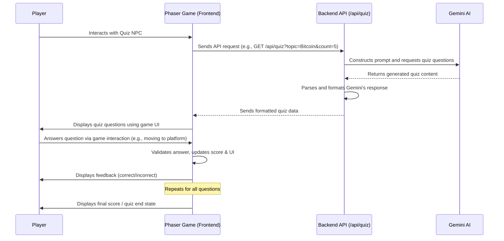

# Gemini-Powered Quiz Application: Design Document

## 1. Overall Architecture

The application consists of three main components:

*   **Frontend (Client-side):** An interactive quiz system integrated within an existing Phaser 3 game. The logic resides in `www/js/index.js`, which manages game state, UI, and interaction with the backend for quiz data.
*   **Backend (Server-side):** A Node.js service, using the existing `api/index.js` Express application. It handles requests from the Phaser game, interacts with the Gemini AI to generate quiz questions, and formats the data for the client.
*   **Gemini AI:** Google's Generative AI model, used to generate quiz questions based on specified topics.

**Interaction Flow (Phaser Game Integration):**



## 2. Backend Design

The backend is responsible for generating quizzes using Gemini AI and serving them to the Phaser game frontend.

*   **Technology:** Node.js with Express, using the existing `api/index.js` application.
*   **API Endpoint:**
    *   **Endpoint:** `GET /api/quiz`
    *   **Request Parameters:**
        *   `topic` (string, required): The subject of the quiz (e.g., "Bitcoin").
        *   `count` (integer, optional, default: 3, used as 5 for the specific Bitcoin quiz): The number of questions to generate.
    *   **Response Structure (JSON):**
        ```json
        {
          "id": "unique_quiz_id_uuid",
          "topic": "User Requested Topic",
          "questions": [
            {
              "q": "What is the capital of France?",
              "a": ["Berlin", "Madrid", "Paris", "Rome"],
              "correct": "Paris"
            }
            // ... more questions
          ]
        }
        ```
    *   **Error Response Example (JSON):**
        ```json
        {
          "error": "Failed to generate quiz",
          "details": "Optional: more specific error message from Gemini or internal processing"
        }
        ```

*   **Gemini AI Interaction Logic (within `GET /api/quiz` handler):**
    *   **Prompt Construction:**
        The backend constructs a detailed prompt for Gemini, for example:
        ```
        Please generate a quiz about the topic: "[topic]".
        The quiz should consist of [count] multiple-choice questions.
        Each question must have exactly 4 answer options.
        For each question, clearly indicate which of the 4 options is the correct answer.
        Return the entire quiz as a single JSON object. This JSON object should have a single key "questions", which is an array. Each element in the "questions" array should be an object with three keys:
        1. "q": A string representing the question text.
        2. "a": An array of 4 strings, representing the answer options.
        3. "correct": A string that exactly matches one of the 4 answer options in the "a" array, indicating the correct answer.
        ```
    *   **Gemini API Call:** Uses `@google/generative-ai` SDK.
    *   **Response Parsing:**
        *   Parses the JSON string from Gemini, with fallback logic to extract from markdown code blocks (```json ... ```) if necessary.
        *   Validates the structure of the parsed data.
        *   The parsed data directly matches the desired `questions` array structure (`q`, `a`, `correct`).

*   **Quiz Data Format (as returned by the API):**
    As specified in the "Response Structure" above.

## 3. Frontend Design (Phaser Game Integration)

The quiz UI and logic are integrated into the existing Phaser 3 game managed by `www/js/index.js`.

*   **Technology Approach:**
    *   Phaser 3 game engine.
    *   Quiz logic is part of the `GameScene` class in `www/js/index.js`.
    *   UI elements (text for questions, answers, feedback, score) are Phaser game objects.
*   **Basic UI Flow:**
    1.  **Quiz Setup:**
        *   The player interacts with a designated NPC (e.g., `npc2`, the copper golem) in the game world.
        *   This interaction triggers the AI Bitcoin quiz (topic "Bitcoin", 5 questions, hardcoded in the NPC interaction logic within `startQuiz`).
    2.  **Loading State:**
        *   The game displays a text message like "Fetching Bitcoin Quiz..." or "Loading question..." while fetching data from the backend.
    3.  **Question Display:**
        *   Questions are displayed one at a time using Phaser text objects.
        *   Answer options are displayed as text on interactive game elements (e.g., platforms).
    4.  **Answering Questions:**
        *   The player answers by moving their character onto the platform corresponding to their chosen answer.
    5.  **Feedback:**
        *   The game provides immediate feedback:
            *   Text display ("Correct!", "Wrong! Answer: X", "Time's up!").
            *   Answer platform/text colors change to indicate correct/incorrect/selected.
    6.  **Quiz Completion & Score:**
        *   After the last question (or if an error occurs that terminates the quiz), the game displays a summary.
        *   This includes the final score (e.g., "Quiz Finished! Final Sats: X").
        *   Game elements like player and NPCs, which might have been visually altered or had their behavior paused, are restored.
*   **Fetching Quiz Data:**
    *   When the player interacts with the quiz NPC, the `startQuiz('AI_BITCOIN_QUIZ')` method in `www/js/index.js` is called.
    *   This method makes an asynchronous `fetch` request to `GET /api/quiz?topic=Bitcoin&count=5`.
    *   The JSON response is parsed and stored in `this.currentQuizData`.
    *   `loadQuestion` is then called to display the first question.
    *   Error handling for the API request is included.

## 4. Data Flow (Summary - Phaser Integration)

1.  **User Action:** Player character in Phaser game interacts with NPC `npc2`.
2.  **Frontend Request:** `www/js/index.js` (`GameScene.startQuiz`) sends a `GET` request: `/api/quiz?topic=Bitcoin&count=5`.
3.  **Backend Processing (`api/index.js`):**
    *   Receives the request via the `/api/quiz` route.
    *   Constructs a prompt for Gemini: "Please generate a quiz about the topic: "Bitcoin". The quiz should consist of 5 multiple-choice questions..."
    *   Sends the prompt to the Gemini API.
4.  **Gemini AI:** Generates quiz content and returns it (potentially wrapped in markdown).
5.  **Backend Formatting:**
    *   Parses Gemini's response (handles direct JSON or extracts from markdown).
    *   Validates the question structures.
    *   Sends the formatted JSON (with `id`, `topic`, `questions` array) back to the Phaser game.
6.  **Frontend Display (Phaser Game):**
    *   `startQuiz` receives the quiz data into `this.currentQuizData`.
    *   `loadQuestion` uses this data to display the first question and options using Phaser text objects.
7.  **User Interaction:** Player moves their character to an answer platform.
8.  **Frontend Feedback:** `checkAnswer` in `www/js/index.js` validates the answer based on player position, updates score, and changes text/colors for feedback.
9.  **(Repeat for all questions or until timer expires on a question)**
10. **Quiz End:** `endQuiz` in `www/js/index.js` displays the final score message and resets quiz-related states. Player and NPCs remain visible throughout.