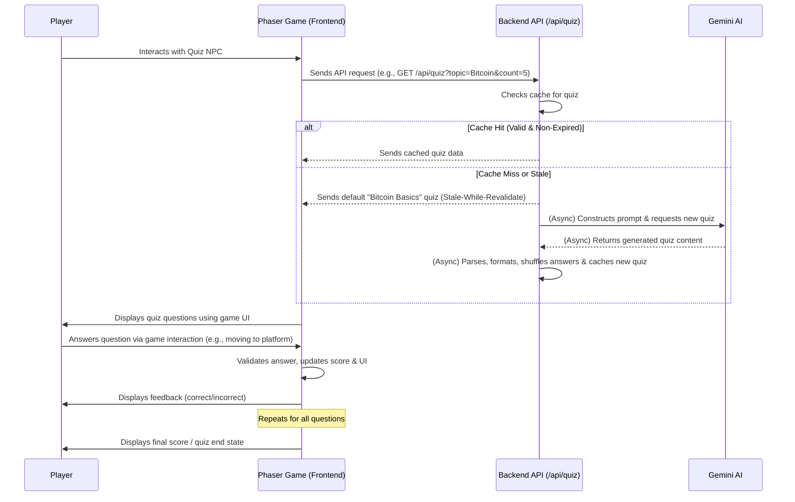
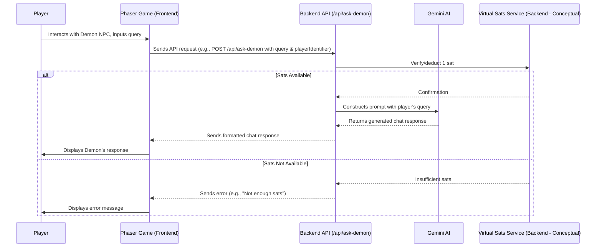

# Gemini-Powered Quiz Application: Design Document

## 1. Overall Architecture

The application consists of several main components:

*   **Frontend (Client-side):** An interactive quiz system integrated within an existing Phaser 3 game. The logic resides in `www/js/index.js`, which manages game state, UI, and interaction with the backend for quiz data and other features.
*   **Backend (Server-side):** A Node.js service, using the existing `api/index.js` Express application. It handles requests from the Phaser game, interacts with the Gemini AI to generate quiz questions and chat responses, manages virtual sats (conceptually), and facilitates real-time multiplayer communication.
*   **Gemini AI:** Google's Generative AI model, used to generate quiz questions based on specified topics and power conversational AI for the Demon NPC.
*   **Socket.IO Server:** Integrated into the backend (`api/index.js`) to manage real-time communication for multiplayer features.

**Interaction Flow (Phaser Game - AI Quiz):**



**Interaction Flow (Phaser Game - AI Demon Chat):**



### 1.1 Multiplayer Overview
The game includes basic real-time multiplayer functionality, allowing players to see each other move within the game world. This is facilitated by a Socket.IO server integrated into the backend, which manages player connections and synchronizes player movements.

## 2. Backend Design

The backend is responsible for generating quizzes and chat responses using Gemini AI, serving them to the Phaser game frontend, managing virtual sats (conceptually), and handling real-time multiplayer communication.

*   **Technology:** Node.js with Express, using the existing `api/index.js` application, and Socket.IO for real-time communication.

### 2.1 AI-Powered Quiz Generation (`/api/quiz`)

*   **Endpoint:** `GET /api/quiz`
*   **Request Parameters:**
    *   `topic` (string, required): The subject of the quiz (e.g., "Bitcoin").
    *   `count` (integer, optional, default: 3, used as 5 for the specific Bitcoin quiz): The number of questions to generate.
*   **Response Structure (JSON):**
    ```json
    {
      "id": "unique_quiz_id_uuid",
      "topic": "User Requested Topic",
      "questions": [
        {
          "q": "What is the capital of France?",
          "a": ["Berlin", "Madrid", "Paris", "Rome"],
          "correct": "Paris"
        }
        // ... more questions
      ]
    }
    ```
*   **Error Response Example (JSON):**
    ```json
    {
      "error": "Failed to generate quiz",
      "details": "Optional: more specific error message from Gemini or internal processing"
    }
    ```
*   **Gemini AI Interaction Logic (within `GET /api/quiz` handler):**
    *   **Prompt Construction:**
        The backend constructs a detailed prompt for Gemini, for example:
        ```
        Please generate a quiz about the topic: "[topic]".
        The quiz should consist of [count] multiple-choice questions.
        Each question must have exactly 4 answer options.
        For each question, clearly indicate which of the 4 options is the correct answer.
        Return the entire quiz as a single JSON object. This JSON object should have a single key "questions", which is an array. Each element in the "questions" array should be an object with three keys:
        1. "q": A string representing the question text.
        2. "a": An array of 4 strings, representing the answer options.
        3. "correct": A string that exactly matches one of the 4 answer options in the "a" array, indicating the correct answer.
        ```
    *   **Gemini API Call:** Uses `@google/generative-ai` SDK.
    *   **Response Parsing:**
        *   Parses the JSON string from Gemini, with fallback logic to extract from markdown code blocks (```json ... ```) if necessary.
        *   Validates the structure of the parsed data.
        *   The parsed data directly matches the desired `questions` array structure (`q`, `a`, `correct`).
*   **Quiz Caching Strategy:**
    *   The server (`api/index.js`) implements a caching mechanism for quizzes to improve performance and reduce API calls to Gemini.
    *   **In-Memory Cache:** Stores up to 10 different versions of a quiz for each unique topic/count combination.
    *   **Expiry:** Each cached version has a 5-minute expiry from when it was fetched from Gemini.
    *   **Pre-shuffled Answers:** Answer options for all cached quizzes are pre-shuffled when stored.
    *   **Cache Hit:** If a valid, non-expired version is found, the most recently fetched one is served immediately.
    *   **Stale-While-Revalidate (Cache Miss/Stale):**
        *   If no valid cached version is found, the server *immediately* responds with a default, pre-defined "Bitcoin Basics" quiz (with its answer options shuffled on-the-fly).
        *   Simultaneously, in the background, the server triggers a call to Gemini AI to generate the *actually requested* quiz.
        *   The newly fetched quiz from Gemini has its answer options shuffled and is then added to the cache.

### 2.2 AI Demon Chat (`/api/ask-demon`)

This endpoint facilitates conversational interactions with the AI Demon NPC.

*   **Endpoint:** `POST /api/ask-demon`
*   **Request Body (JSON):**
    ```json
    {
      "query": "Player's question for the demon",
      "playerIdentifier": "unique_player_id_or_session_id" // For sat management
    }
    ```
*   **Response Structure (JSON):**
    ```json
    {
      "response": "Demon's chat message from Gemini AI"
    }
    ```
*   **Error Response Example (JSON):**
    ```json
    {
      "error": "Failed to get response from Demon",
      "details": "e.g., Insufficient sats, Gemini API error, Invalid request"
    }
    ```
*   **Gemini AI Interaction Logic:**
    *   The backend constructs a prompt for Gemini based on the player's query, framed for a conversational AI. Topics include Bitcoin, Lightning Network, and Lightning Service Providers (LSPs).
    *   Uses `@google/generative-ai` SDK for the API call.
*   **Sat Cost:** 1 virtual sat per query. The backend verifies and deducts this before calling Gemini.

### 2.3 Virtual Sats Economy

The game features a virtual currency called "Sats" (Satoshis).

*   **Overview:** Players earn and spend virtual sats through various in-game activities.
*   **Earning Sats:**
    *   Completing lessons from "Knowledge NPCs."
    *   Providing correct answers in quizzes.
*   **Spending Sats:**
    *   Interacting with the AI Demon NPC for chat (1 sat per query).
    *   (Future: Potentially other in-game items or interactions).
*   **Backend Management (Conceptual):**
    *   For the current scope, sat management can be session-based, associated with the player's active game session.
    *   The backend (`api/index.js`) would include logic to:
        *   Track a player's sat balance (e.g., in memory, tied to a session ID or a temporary player identifier passed in requests).
        *   Award sats for quiz completion/correct answers (client informs backend, backend validates and updates balance).
        *   Deduct sats for services like the AI Demon Chat.
    *   *Note: Persistent sat balances across sessions would require user accounts and a database, which is a future consideration.*

### 2.4 Real-time Multiplayer (Socket.IO)

The backend uses Socket.IO to manage real-time multiplayer interactions.

*   **Overview:** Enables players to see each other's characters move in the game world in real-time.
*   **Server-side Logic (`api/index.js`):**
    *   **Connection Handling:** Manages new Socket.IO connections from clients.
    *   **Player State Management:** Keeps track of connected players, their unique IDs, and their current positions/states.
    *   **Broadcasting Updates:** Relays player movements and other relevant events to all other connected clients.
*   **Key Socket.IO Events Handled:**
    *   `connect`: A new player connects to the server.
    *   `disconnect`: A player disconnects.
    *   `playerMoved`: A client sends its player's new position; the server broadcasts this to other clients.
    *   `newPlayer`: When a new player connects, the server informs existing clients.
    *   `currentPlayers`: When a new player connects, the server sends them a list of already connected players.

## 3. Frontend Design (Phaser Game Integration)

The quiz UI, AI Demon chat, sats display, and multiplayer rendering are integrated into the existing Phaser 3 game managed by `www/js/index.js`.

*   **Technology Approach:**
    *   Phaser 3 game engine.
    *   Logic is primarily within the `GameScene` class in `www/js/index.js`.
    *   UI elements are Phaser game objects (text, sprites, interactive zones).

### 3.1 Basic UI Flow (Quiz)
1.  **Quiz Setup:**
    *   Player interacts with a designated NPC (e.g., `npc2`, the copper golem).
    *   Triggers AI Bitcoin quiz (topic "Bitcoin", 5 questions).
2.  **Loading State:**
    *   Displays "Fetching Bitcoin Quiz..." or "Loading question...". If a cached quiz is not immediately available, the player might first see the "Bitcoin Basics" default quiz while the specific AI quiz is fetched in the background.
3.  **Question Display:**
    *   Questions and answer options displayed using Phaser text objects on interactive platforms.
4.  **Answering Questions:**
    *   Player moves character onto the platform corresponding to their chosen answer.
5.  **Feedback:**
    *   Immediate feedback ("Correct!", "Wrong! Answer: X", "Time's up!").
    *   Platform/text colors change.
6.  **Quiz Completion & Score:**
    *   Displays final score (e.g., "Quiz Finished! Final Sats: X").
    *   Game elements restored.

### 3.2 Fetching Quiz Data
*   `startQuiz('AI_BITCOIN_QUIZ')` in `www/js/index.js` is called.
*   Makes `fetch` request to `GET /api/quiz?topic=Bitcoin&count=5`.
*   Response (cached, default, or newly generated) is parsed into `this.currentQuizData`.
*   `loadQuestion` displays the first question.
*   Error handling for API request included.

### 3.3 AI Demon Chat Integration
*   **Trigger:** Player interacts with the Demon NPC ([`www/img/characters/demon.png`](www/img/characters/demon.png)).
*   **UI Elements:**
    *   A simple input field or prompt for the player to type their question/chat message.
    *   A display area (e.g., a text box or speech bubble above the Demon) for the Demon's AI-generated responses.
    *   Notifications for sat cost (e.g., "Cost: 1 Sat to ask") and feedback if sats are insufficient.
*   **Interaction Logic (`www/js/index.js`):**
    *   On interaction, present the chat input UI.
    *   On submitting a query, send a `POST` request to `/api/ask-demon` with the query and a player/session identifier.
    *   Display the Demon's response received from the API.
    *   Handle and display any errors (e.g., "Not enough sats," API errors).
    *   Update the player's displayed sat balance.

### 3.4 Virtual Sats Display
*   **UI Element:** A dedicated text object in the game's HUD (Heads-Up Display) shows the player's current virtual sat balance (e.g., "Sats: 100").
*   **Updates:** This display is updated whenever the player earns or spends sats (e.g., after a correct quiz answer, after paying for AI Demon chat). The client-side logic will modify this text object.

### 3.5 Multiplayer Presence Rendering
*   **Representation:** Other players are rendered as distinct sprites/characters in the game world.
*   **Movement Updates:** The client listens for Socket.IO events (`playerMoved`, `newPlayer`, `playerDisconnected`).
    *   `playerMoved`: Updates the position of the corresponding remote player's sprite.
    *   `newPlayer`: Creates a new sprite for the new remote player.
    *   `playerDisconnected`: Removes the sprite of the disconnected player.
*   **Client-side State:** `www/js/index.js` maintains a collection of remote player objects/sprites, mapping them by their server-assigned IDs.

## 4. Data Flow (Summary)

### 4.1 Data Flow (Quiz - Phaser Integration)
1.  **User Action:** Player interacts with NPC `npc2`.
2.  **Frontend Request:** `www/js/index.js` (`GameScene.startQuiz`) sends `GET /api/quiz?topic=Bitcoin&count=5`.
3.  **Backend Processing (`api/index.js`):**
    *   Receives request.
    *   **Checks cache:** If valid quiz exists, returns it.
    *   **Cache miss/stale:** Returns default "Bitcoin Basics" quiz immediately. Asynchronously, constructs prompt for Gemini for "Bitcoin", 5 questions, sends to Gemini API.
4.  **Gemini AI (Async if cache miss):** Generates quiz content.
5.  **Backend Formatting & Caching (Async if cache miss):**
    *   Parses Gemini's response.
    *   Validates, shuffles answers, and caches the new quiz.
    *   (If initial request was served by default quiz, this new quiz is now available in cache for subsequent requests).
6.  **Frontend Display (Phaser Game):**
    *   `startQuiz` receives quiz data (cached, default, or eventually the new one).
    *   `loadQuestion` displays questions/options.
7.  **User Interaction:** Player moves to answer platform.
8.  **Frontend Feedback:** `checkAnswer` validates, updates score/UI.
9.  **(Repeat)**
10. **Quiz End:** `endQuiz` displays final score, resets states.

### 4.2 Data Flow (Summary - AI Demon Chat)
1.  **User Action:** Player interacts with Demon NPC, inputs chat query.
2.  **Frontend Request:** `www/js/index.js` sends `POST /api/ask-demon` with the query and player/session identifier.
3.  **Backend Processing (`api/index.js`):**
    *   Receives request.
    *   Verifies player has sufficient sats and deducts 1 sat (conceptual sat service).
    *   If sats are sufficient, constructs prompt for Gemini AI with the player's query.
    *   Sends prompt to Gemini API.
4.  **Gemini AI:** Generates chat response.
5.  **Backend Response:**
    *   If successful, sends Demon's chat response back to the Phaser game.
    *   If error (e.g., insufficient sats, Gemini error), sends an error message.
6.  **Frontend Display (`www/js/index.js`):**
    *   Displays the Demon's response or error message in the chat UI.
    *   Updates displayed sat balance.